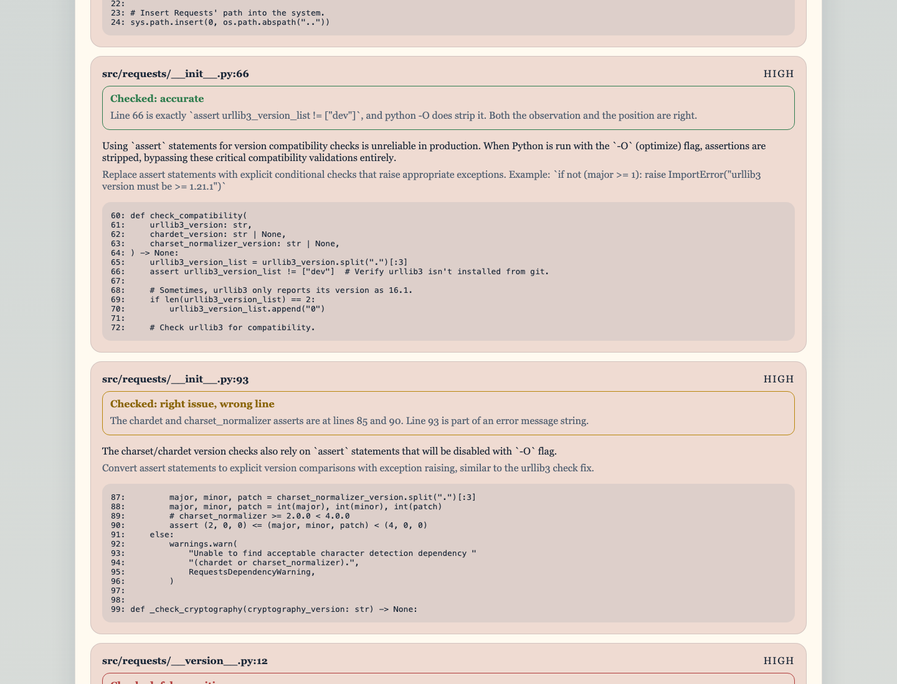
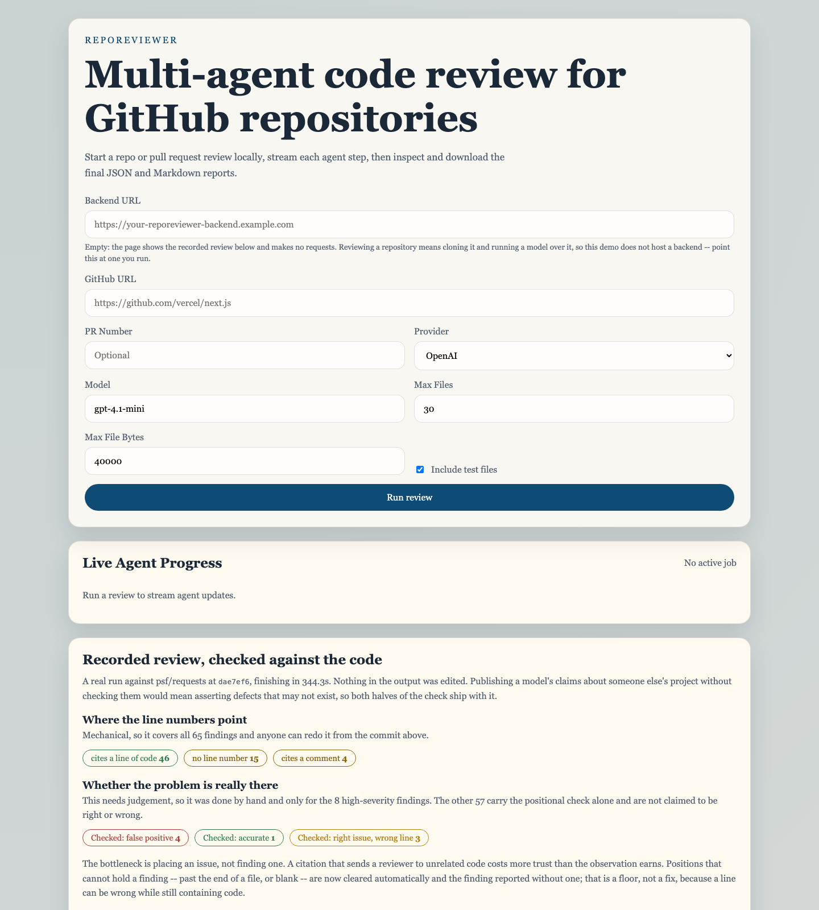
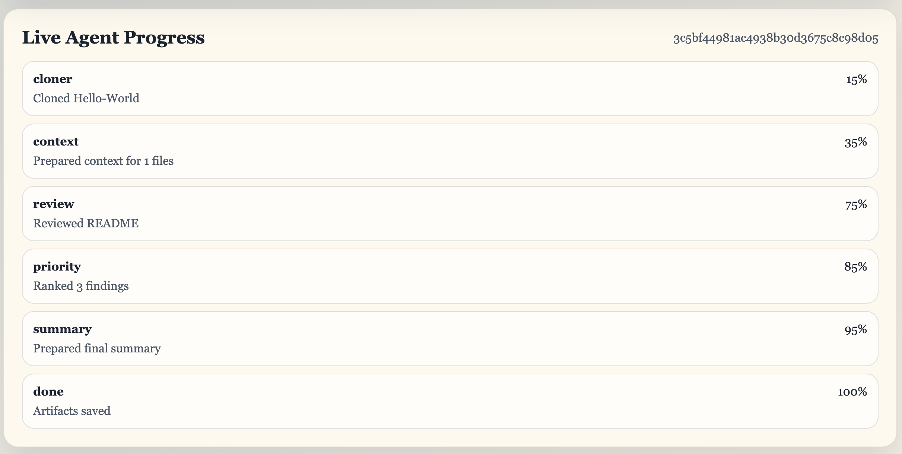

# RepoReviewer

[](https://github.com/peng1z/RepoReviewer/actions/workflows/ci.yml)

RepoReviewer is a local-first Python CLI plus web UI that runs a multi-agent code review workflow on public GitHub repositories. It uses FastAPI for the backend API, LangGraph for agent orchestration, LiteLLM for provider abstraction, PyGithub for PR metadata, and Next.js for the frontend.

Paper: [RepoReviewer on arXiv](https://arxiv.org/abs/2603.16107)



## Features

- Review a public GitHub repository or pull request from the CLI or web UI
- Multi-agent pipeline: clone, context building, file review, prioritization, and summary
- Supports OpenAI, Anthropic, OpenRouter, and Groq via LiteLLM-compatible model names
- Streams live agent progress to the web UI with Server-Sent Events
- Saves `review.json` and `review.md` for every run
- Groups findings by severity and includes code snippets for each comment
- Skips generated, binary, ignored, and oversized files

## UI Preview

### Home



### Running Review



### Final Report


## Architecture

### Backend

- `backend/src/repo_reviewer/cli.py`: Typer CLI entrypoint
- `backend/src/repo_reviewer/api.py`: FastAPI app with review, status, SSE, and artifact routes
- `backend/src/repo_reviewer/workflow.py`: LangGraph node definitions
- `backend/src/repo_reviewer/service.py`: shared review runner and job store

### Frontend

- `frontend/app/page.tsx`: single-page dashboard
- `frontend/components/review-dashboard.tsx`: review form, live progress, result rendering

## Setup

### Backend

```bash
cd backend
/opt/anaconda3/bin/python3 -m venv .venv313
source .venv313/bin/activate
pip install -e ".[dev]"
```

Copy the example environment file and fill in only the keys you need:

```bash
cp .env.example .env
```

Run the API:

```bash
uvicorn repo_reviewer.main:app --reload --app-dir src
```

Run the CLI:

```bash
repo-reviewer review https://github.com/owner/repo
repo-reviewer review https://github.com/owner/repo --pr 123 --provider openrouter --model openrouter/openai/gpt-4.1-mini
```

### Frontend

```bash
cd frontend
npm install
npm run dev
```

Use a Node LTS release for the frontend, preferably Node 20 or Node 22. Avoid Node 25 for local development.

This repository includes [`.nvmrc`](./.nvmrc), so with `nvm`:

```bash
nvm use
```

The frontend expects the FastAPI backend at `http://127.0.0.1:8000`. Override with:

```bash
NEXT_PUBLIC_API_BASE=http://127.0.0.1:8000
```

## CLI Usage

```bash
repo-reviewer review <github_url> [--pr <pr_number>]
```

Important flags:

- `--provider`: `openai`, `anthropic`, `openrouter`, `groq`
- `--model`: model name or `provider/model`
- `--max-files`: cap reviewed files in non-PR mode
- `--max-file-bytes`: skip oversized files
- `--skip-tests`: exclude tests
- `--output-root`: choose the artifact directory

## Output

Each run writes artifacts to:

```text
outputs/<repo>-<timestamp>/
```

Files:

- `review.json`
- `review.md`

## Mutation Benchmark

Review quality is measured against defects that are injected on purpose, so the
ground truth is known by construction rather than annotated by hand.

```bash
repo-reviewer benchmark backend/datasets/mutation-benchmark.json
```

The harness clones each target repository, injects one known defect at a time,
runs every ablation method over the mutated copy, and scores each finding
automatically:

- **hit** -- a finding within 3 lines of the injected defect, in the right file
- **weak_hit** -- right file, wrong or missing line, but the text describes the defect
- **miss** -- neither

Five single-line operators are used (`off_by_one`, `negate_condition`,
`swap_operator`, `invert_none_check`, `widen_except`). Each rewrites exactly one
line and leaves every other line number untouched, which is what makes positional
scoring meaningful. Defects are only injected into files the pipeline will
actually review, so the metric measures review quality rather than file
selection.

Outputs land in the experiment directory:

- `mutant-outcomes.csv` -- one row per mutant/method pair
- `benchmark-summary.csv` / `.json` / `.tex` -- detection rate per method
- `unreachable.json` -- repositories that yielded no valid mutant

See [docs/mutation-benchmark-design.md](./docs/mutation-benchmark-design.md) for
the design rationale and the constraints it works around.

## Config

You can add a `.repo-reviewer.toml` file to a reviewed repository to define:

- ignore globs
- max files
- max file size
- include tests
- snippet radius

## Roadmap

- LLM-as-judge as a secondary scoring signal alongside keyword matching
- Private repository support
- Deployment-ready backend/frontend split
- Historical run storage
- GitHub PR comment publishing

## License

MIT. See [LICENSE](./LICENSE).

## Security Notes

- Do not commit `.env`; it is ignored by Git and should remain local only.
- Prefer `GITHUB_TOKEN` even for public repos if you want better GitHub API limits.
- Rotate provider keys any time you believe they may have been exposed.
